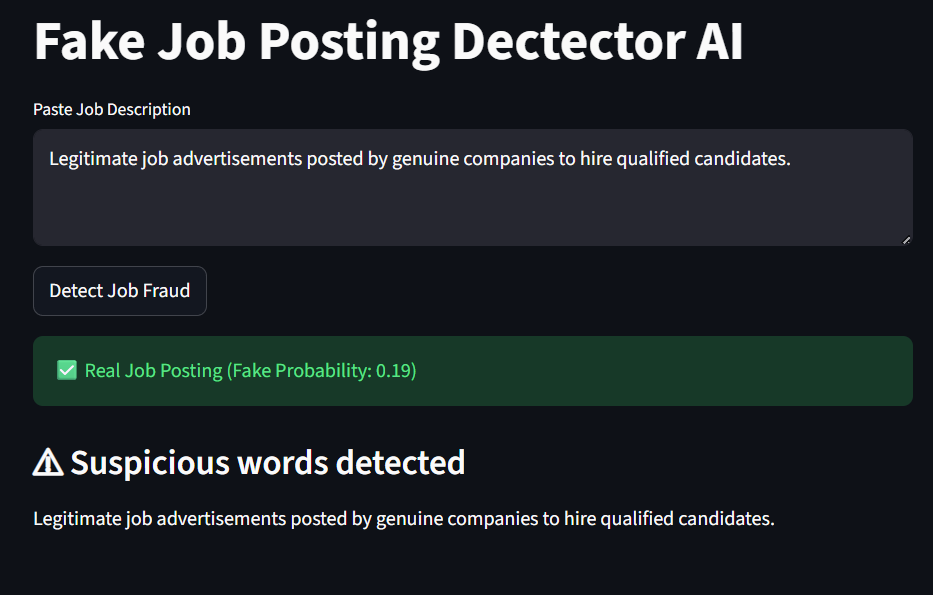
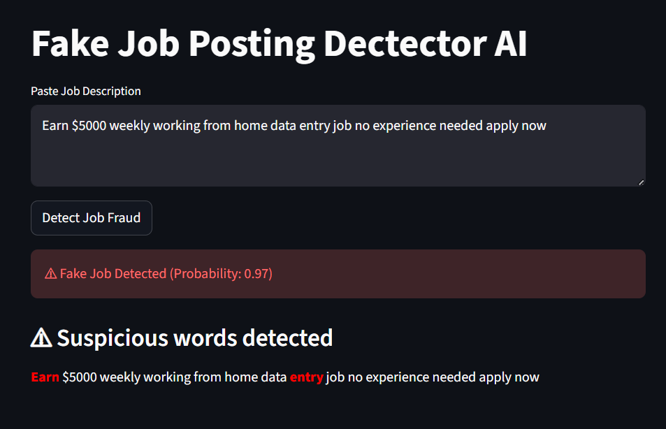

# Fake Job Posting Detector AI

AI system that detects fraudulent job postings using Machine Learning and Natural Language Processing.

---

# Project Overview

Fake job postings are common on online job portals.
This project builds an **AI system that analyzes job descriptions and predicts whether the posting is real or fraudulent.**

The system also highlights suspicious words and shows a **Fraud Risk Meter** to explain the prediction.

---

# Key Features

* NLP text preprocessing
* TF-IDF feature engineering
* Logistic Regression classification
* Fraud risk visualization
* Suspicious keyword highlighting
* Interactive web application

---

# Machine Learning Workflow

Dataset
↓
Text Cleaning
↓
TF-IDF Vectorization
↓
Logistic Regression Model
↓
Prediction
↓
Fraud Risk Meter + Explainability

---

# Model Performance

Accuracy: **96%**

The model handles **imbalanced datasets** and focuses on detecting fraudulent postings effectively.

---

# Application Screenshots

### Web App Interface

---

### Fraud Detection Result

---

# Technologies Used

* Python
* Scikit-learn
* Pandas
* NLTK
* Streamlit

---

# Project Structure

fake-job-detector-ai
│
├── app.py
├── fake_job_model.pkl
├── tfidf_vectorizer.pkl
├── requirements.txt
├── README.md
└── images
    ├── app_interface.jpg
    └── prediction_result.jpg

---

# Run Locally

Install dependencies:

pip install -r requirements.txt

Run the web app:

streamlit run app.py

---

# Future Improvements

* Deploy the application online
* Improve explainable AI visualization
* Add deep learning NLP models

---

# Author

**Abhay**
AI & Machine Learning Enthusiast
